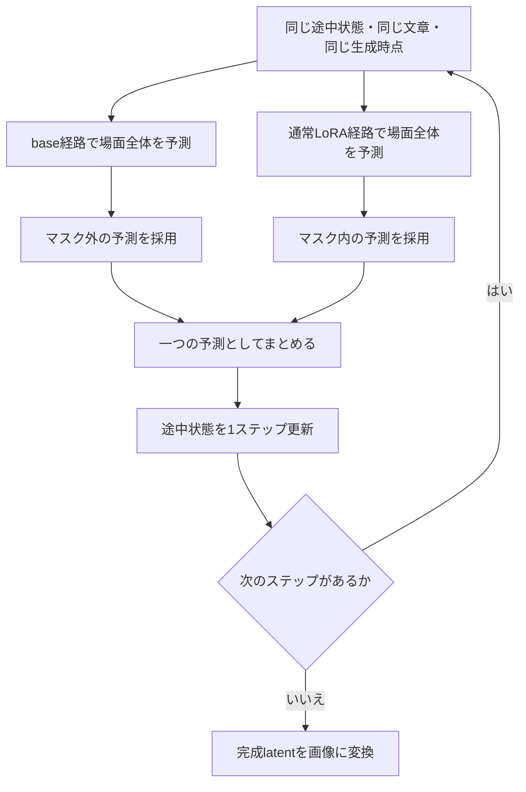

# LoRAの効果が弱くなった理由と、予測混合による改善の検討記録

作成日：2026年10月9日

対象：FreeFuse-for-sliderlora / Krea2 / deaging Slider LoRA

今回、有効性を確認したワークフロー：[krea2_slider_mix_half.json](../workflows/krea2_slider_mix_half.json)

この文書は、「左の人物だけにLoRAを効かせたいのに、通常の全体適用より効果が弱い」という問題について、何を疑い、どのように比較し、何が分かったかをまとめたものです。ここでいう「当初の方式」は、通常の **Krea2 Slider Fuse Samplerによる局所hook方式**を指します。

本書は、実装・比較手順を記録した既存文書に、その後受領した実機結果の評価を加えた整理です。既存文書にある「実機未確認」は、その文書を作成した時点の記録として読み分けてください。

## 1. 先に結論

**今回の検討では、Prediction Mix方式によって、対象人物への強いLoRA効果と、もう一人の成人らしい外見の維持を両立できました。**

有効性を確認したのは、**固定した左半分の手動マスクを使う`krea2_slider_mix_half.json`**です。この検討で使った0.1.4のPrediction Mix Samplerは手動マスク用であり、この結果によって自動マスクの問題まで解決したとは判断していません。0.2.0でauto接続と選択専用余白を実装した後の状態は[現行ガイド](prediction-mixing.md)を参照してください。

以前の局所hook方式でも左人物の顔は子供らしくなりましたが、通常の全体適用に比べて胴や脚が長く残り、頭身・体格の変化が弱くなっていました。Prediction Mixでは、大きな頭、短い四肢、低い頭身といった変化がより強く現れています。

ただし、「なぜ弱かったか」には、別々の問題が含まれていました。

| 問題 | 何が起きていたか | 現時点の判断 |
|---|---|---|
| 自動マスクの適用漏れ | 顔がマスクに入らず、その場所に直接LoRA差分を加えられなかった | 初期の失敗例で確認済み。ただし比較したLoRAファイル・強度にも違いがあった |
| LoRAの作用範囲の制限 | 通常なら画像全体・文章側にも作用するLoRAを、画像の一部分などに限定した | 手動マスクでも残った減弱を説明する、最も有力な要因 |
| 数値計算の違い | 独自hookと通常Loaderでは、計算順序や低精度での丸め方が異なる | 差はあるが、今回の大きな減弱の主因と断定する証拠はない |

**「strengthの数字を間違って小さくしていた」とは考えにくい結果です。** 同じstrengthでも、モデル内部のどこに、どの範囲でLoRAを作用させるかによって、最終画像の変化は異なります。

この結論は、今回のモデル・LoRA・人物配置・生成条件で得たものです。すべてのLoRAや構図で同じ結果になることまでは確認していません。

## 2. 読むために必要な言葉

| 言葉 | この検討での意味 |
|---|---|
| LoRA / Slider LoRA | 元の画像生成モデルに、小さな追加の変更を与える仕組み。今回は人物を若く、子供らしくする方向の学習済みLoRAを使用 |
| strength | LoRAの適用倍率。値を2から4にしても、見た目の変化が正確に2倍になるとは限らない |
| マスク | 効果を採用する場所を示す白黒の地図。今回の手動比較は、白い左半分が対象、右半分が保護側 |
| token | モデルが扱う情報の単位。文章では単語の一部など、画像では小さな領域に相当する |
| attention | 画像の各部分や文章の情報が、互いを参照する仕組み。左側への変更が右側に間接的に影響する経路にもなる |
| hook | 元の処理に追加処理を差し込む仕組み。旧方式では、モデル内部の計算結果に局所的なLoRA差分を加えるために使用 |
| latent | 画像をモデル内部で扱うための数値表現。完成したPNG画像そのものではない |
| 予測 / prediction | 各生成ステップでモデルが返す、次の更新に使う数値。今回保存したものはComfyUIのサンプリングに渡す予測 |
| seed | 最初のノイズを決める数値。比較では同じseedに加え、モデル・prompt・設定も揃える必要がある |
| audit | 処理が意図どおりだったかを、数値や実行記録で確認するための監査 |

本書の「右人物を保護する」は、主に年齢感や体格など、変えたくない特徴を大きく変えないことを指します。**右側の全画素を完全に固定できた、という意味ではありません。**

## 3. 当初の方式は、何をしていたのか

### 3.1 通常の全体LoRA適用

通常のLoaderでSlider LoRAを適用すると、対象となるモデル内部の重みに変更が加わります。Krea2では、同じattentionの処理に画像情報と文章情報が入るため、このLoRAの作用は画像領域だけに限られません。

今回の通常全体適用では、左人物も右人物も強く幼児化しました。これはLoRA自体には十分な作用があることを示す参照結果になりました。

### 3.2 旧局所hook方式

旧方式は、モデル内部の対象となる各計算で、次のような処理をします。

```text
元の計算結果 ＋ strength × 対象マスク × LoRAによる追加分
```

画像の対象領域にだけ追加分を入れ、対象外への直接の追加分をゼロにします。初期設定では、文章側の情報にも直接のLoRA差分を入れません。

この方法は、保護対象への直接作用を抑えるための設計でした。一方で、通常の全体LoRAが使っている文章側や領域間の作用も制限します。結果として、同じ強度を指定していても、顔だけでなく頭身・体格まで一緒に変える働きが弱くなったと考えるのが、今回の結果に最も整合します。

ここは**実験からの解釈**です。全層のどの情報伝達がどれだけ失われたかまで、個別に証明できたわけではありません。

### 3.3 当初の説明として当てはまらなかったこと

- **マスクが半分だから、選択された場所のstrengthも半分になる、という処理ではありません。** 面積でstrengthを割る計算はありません。
- LoRAの基本係数である`alpha/rank`は、確認した実機LoRAでは16/16＝1です。ここで意図せず強度が小さくなった証拠はありません。
- 旧hookの診断では、対象140モジュールすべてに到達し、8ステップで合計1,120回の呼び出しが記録されています。多数の層に適用されていなかった、という説明も支持されません。
- 自動モードでは、マスクを調べた後に**同じ初期ノイズ・latent・全ステップから生成をやり直します**。序盤をLoRAなしで進めた途中画像から、残りのステップだけを生成する設計ではありません。

## 4. 何を検討し、それぞれ何を確かめたかったのか

「効かない」という見た目だけでは、原因を一つに決められません。そこで、適用場所、文章への作用、計算方法、実装の正しさを順に切り分けました。

| 段階 | 検討した項目 | 比較の意図 | 得られた結果・到達点 |
|---|---|---|---|
| 1 | 手動マスクと自動マスク | 自動で見つけた適用場所が間違っていないか | 初期auto例で顔の欠落を確認。ただし初期manual/autoはLoRA・強度も異なったため、単独原因とは断定しなかった |
| 2 | 生の類似度mapと白黒マスクの表示 | 顔を最初から見つけられないのか、白黒に分けるときに落ちるのか | 観測用の表示・統計を追加。表示を追加したこと自体は画質改善ではない |
| 3 | 対象語・収集時点・map設定 | 衣服への偏りや、情報を読む時期が影響していないか | 比較用workflowを用意。`woman/man`などを使った候補設定で改善例を確認したが、複数変更のため各設定の寄与は未分離 |
| 4 | 穴埋め・膨張 | マスク内の小さな未適用部分や輪郭不足を補えるか | 保護側を上書きしない処理とCPU検証を追加。マスクを広げることだけで全体の減弱が解決したとは判断していない |
| 5 | 対象語への文章側LoRA | 文章側にも少し作用させると効果が回復するか | 対象語のみでは、後の手動診断で改善が小さかった |
| 6 | 標準Sampler・native・hookのゼロ比較 | 診断処理やSamplerの違いだけで画像が変わっていないか | 保存された比較ではゼロ条件が数値的に一致 |
| 7 | 通常LoRA対「全面・全文hook」 | 範囲を同じにしても、独自LoRA計算そのものが弱いのか | 数値差は残るが、両者は近く、画像では両人物が強く幼児化 |
| 8 | 画像範囲と文章範囲を分けた比較 | どの制限で効果が弱まり、どこを広げると保護側へ影響するか | 左半分＋文章なし／対象語のみでは効果が弱い。文章全体へ広げると左は強まるが右も幼児化 |
| 9 | Prediction Mix | 通常LoRAの働きを使い、出力する予測の段階で適用場所を選べるか | 左への強い変化と、右の成人性の維持を両立する結果を確認 |
| 10 | 保存tensor・全ステップのaudit | 見た目が良くても、内部で誤った経路や範囲を選んでいないか | 保存値から再計算し、各ステップで意図した予測選択と完全一致 |
| 11 | 強度・seed・promptの変更 | 最初の1枚だけの成功ではないか、調整が効くか | 複数条件でも局所効果を確認。一方で背景の縦段差とマスク越境を発見 |

「比較用workflowを用意した項目」と「実機で結果を確認した項目」は区別しています。例えば、収集stepを変える比較案があることだけで、その設定が有効だったとは判断していません。

## 5. 自動マスクの問題から分かったこと

最初のauto失敗例では、64×64のマスクが細かく分断され、目視で定めた顔の範囲に白い部分がありませんでした。白くない場所には直接のLoRA差分が加わらないので、顔への効果が弱いことと整合します。

その後、対象語を`woman/man`、`top_k_ratio=0.2`、`temperature=10000`などにした候補設定では、マスクのまとまりと顔への適用範囲が改善しました。

ただし、ここでの注意点は二つあります。

1. 比較の途中でLoRAファイル、強度、対象語なども変わっていたため、「temperatureを上げたから改善した」と一つの変更に帰属できません。
2. 手動で左半分全体を覆っても、通常全体適用ほど頭身・体格が変わらない問題が残りました。そのため、マスクの穴だけでは減弱全体を説明できませんでした。

穴埋め・膨張は、適用場所を補う対策です。通常LoRAが持つ作用を、制限された処理の中でどこまで再現できるかという問題は、別に調べる必要がありました。

詳しい初期記録：[自動マスク調査](auto-mask-investigation.md)、[候補設定](auto-mask-candidate.md)、[後処理](mask-postprocessing.md)

## 6. 文章側を調べた理由と、その結果

「画像を変えるLoRAなのに、文章が関係するのか」と感じるかもしれません。Krea2の内部では、文章から得た情報と画像の情報が一緒に処理されます。そのため、同じLoRAでも、文章側へ作用させるかどうかで画像の結果が変わります。

ここでいう文章側は、**Krea2内部の文章tokenの処理**です。CLIPなどの文章エンコーダーの重みを変更したという意味ではありません。

後の診断では、次の3通りを比較しました。

| 文章への適用 | 元のpromptでの対象 | 見た目の結果 |
|---|---|---|
| `none` | 0 token | 左の顔は子供化するが、体格の変化は全体適用より弱い |
| `target_phrase` | `woman`に対応する1 token | `none`からの改善は小さい |
| `all` | 文章107 token全体 | 左の低頭身化は強まるが、右も幼児化する |

対象語1つにLoRAを加えることと、通常の全体LoRAの作用を再現することは同じではありませんでした。また、文章全体へ作用させれば、右人物に関係する情報にも影響します。

この結果から、**「文章側を増やせば解決」という単純な調整では、効果の強さと人物保護を両立しにくい**と分かりました。

設定と実装の説明：[対象phraseへの文章側LoRA](target-text-routing.md)

## 7. 通常Loaderとの比較で、計算ミスをどこまで疑えたか

まず、通常の標準KSamplerと、診断用native経路の保存latentは、ゼロ条件・全体適用条件とも一致しました。さらに、旧`native_zero`と旧`hook_zero`の初回予測・最終latentも一致しました。

次に、画像も文章も全面に適用する`hook_all_all`を、通常LoRAの`native_global`と比較しました。

| 指標 | 両者の相対L2差 |
|---|---:|
| 最初の予測 | 約1.69% |
| 最終latent | 約2.73% |

相対L2差は、二つの数値配列の違いを参照側の大きさで割った指標です。**「LoRAの効果が1.69%弱い」「画質が97.27%一致する」という意味ではありません。** この比較に画質合格の閾値を設けたわけでもありません。

画像では、通常LoRAも全面・全文hookも、左右の人物を強く幼児化しました。したがって、独自hookの計算そのものが、どの条件でも大幅に効力を失わせているとは考えにくい結果です。

BF16という低精度の計算による差は実際にあります。例えば代表層の一部では、計算した追加分と、加算後に残った追加分の大きさに違いがありました。ただし、旧記録は最初のblock・最初の呼び出しの代表統計です。全層・全ステップの損失量を示すものではなく、大きな見た目の減弱を丸めだけに帰属できません。

## 8. Prediction Mixは、何を変えたのか

Prediction Mixでは、各ステップで**同じ途中状態を二つの経路に渡します**。

- **base経路**：今回のSliderを適用しない予測。全体用のdarkbrush LoRAは含みます。
- **Slider経路**：通常Loaderで今回のSliderを全体に適用した予測。

その後、対象マスクの内側ではSlider側、外側ではbase側の予測を選びます。



式で書くと、今回の二値マスクでは次の選択です。

```text
マスクが白い場所：通常LoRAを適用した予測
マスクが黒い場所：baseの予測
```

**二枚の完成画像を最後に切り貼りする方式ではありません。** 一つの生成ループの中で、毎ステップの予測を選択しています。

旧方式は、モデル内部の複数の計算で追加分を制限していました。新方式は、通常LoRAの画像・文章を通じた計算を行った後、その予測の採用場所を選びます。この変更によって、通常LoRAの強い働きを対象側に残せたと解釈できます。

実機の保存tensorでは、初回のSlider経路は`mix_all`、base経路は`mix_none`の予測と完全一致しました。さらに全8ステップで、実際の混合予測が上の選択と完全一致しました。**予測を選ぶ処理で、選択側の数値を薄めていないことを確認しています。**

ただし2ステップ目以降は、局所編集した途中状態と全体編集した途中状態が異なります。そのため、最終画像の左半分が`mix_all`と完全一致する仕組みではありません。

実装：[予測の選択](../slider_fuse/prediction_mixing.py)、[二経路を評価するSampler](../slider_fuse/native_pair.py)

## 9. 基本比較の結果

共通条件は、元の男女2人のprompt、seed42、1024×1024、8 steps、Euler/simple、CFG1、Slider強度4です。ゼロ条件だけ強度0にしています。

| 条件 | 何を確かめる条件か | 観察・数値結果 |
|---|---|---|
| `mix_zero` | 強度0なら何も加わらないか | `mix_none`と全ステップの入力・予測、最終latent、RGBが完全一致 |
| `mix_none` | 強度4を設定しても、採用範囲が空ならbaseだけになるか | baseを8回、Sliderを0回評価。ゼロ条件と一致 |
| `mix_all` | 全面を選べば通常全体適用を再現するか | 前回の`native_global`と初回予測・最終latent・RGBが完全一致 |
| `mix_half` | 左の強い効果と右の保護を両立できるか | 左は強い幼児化・低頭身化、右は成人性を概ね維持 |

旧方式との見た目の比較も、次のように整理できます。

| 方式 | 左人物 | 右人物 |
|---|---|---|
| 旧`hook_half_none` | 顔は子供化するが、胴脚が比較的長く残る | 成人性を維持する見た目 |
| 旧`hook_half_target` | `none`からの改善は小さい | 成人性を維持する見た目 |
| 旧`hook_half_all` | 強い幼児化に近づく | 右も幼児化する |
| 新`mix_half` | 全体適用に近い強い顔・頭身・体格の変化 | 成人性を概ね維持する |

「全体適用に近い」は画像を見た評価で、年齢や同一人物性を自動測定した判定ではありません。

## 10. 右人物に細かな変化が残る理由

マスク外でbase予測を採用しても、そのbase経路が見る入力には、前のステップで変更した左人物の情報が含まれます。モデルは、その途中状態を含む場面全体を見て次の予測を作ります。

実際に、`mix_half`と未編集の`mix_none`の右半分を比べると、次の順番で差が発生しました。

| ステップ | 右半分の入力の差 | 右半分の予測の差 |
|---|---|---|
| 1 | なし | なし |
| 2 | まだなし | 発生する |
| 3 | 発生する | 続く |

2ステップ目には、右側の入力そのものは同じでも、左側を含む全体の入力が違っています。そこから右側のbase予測も変わるという観測は、領域間の間接的な影響と整合します。

そのため、顔の細部、服のしわ、手指、立ち位置、背景まで完全に固定されるわけではありません。**「右にSlider予測を直接採用しない」と「右の完成画像が一切変わらない」は、別の条件です。**

## 11. 強度・seed・promptを変えた追加検討

追加データでは、モデル・LoRA・基本的なSampler設定を維持し、強度、seed、promptを変えました。

| 条件 | 主な観察 |
|---|---|
| 元prompt・seed42・強度2と4 | 強度4の方が頭が大きく、胴脚・四肢が短い。強度による調整が見た目で成立 |
| 元prompt・seed444444・強度2と4 | 同じ方向の変化を確認。右人物は両方とも成人の見た目 |
| 元prompt・seed10000000000000000000・強度4 | 左に強い変化。対象人物の右腕・胴の輪郭が、固定した左半分マスクを越える |
| 正面スタジオ・seed42・強度4 | 左は強く変化し、右は成人体格。中央付近に背景の縦段差が見える |
| 女性は腰に手、男性は腕組み・seed42・強度4 | 指定姿勢への追従と局所効果を確認。大きな破綻や明瞭な中央の継ぎ目は見られない |
| 公園・seed42・強度4 | 背景が複雑でも左に強い変化。道・樹木・影は自然につながる |

追加分の7診断run・計56ステップについて、保存tensorと予測選択の完全一致を確認しました。これにより、少なくとも今回の追加条件では、予測の選び間違いは見つかっていません。

データが揃っていない例もあります。

- seed888888888888888・強度4はJSON・tensorを検証できましたが、生成RGBがなく、画質を評価できませんでした。
- seed444444・強度2は画像のmetadataから条件を確認しましたが、対応JSON・tensorがなく、数値監査はできませんでした。
- 新しいseed・promptごとの`none / all`参照は揃っていません。そのため、見た目が成人でも、元の人物をどれほど忠実に保持できたかは未確定です。

### 強度を下げたときに分かったこと

元prompt・seed42の強度2と4は、強度以外の条件が一致する比較です。

| 基準の`mix_none`との差 | 強度2 | 強度4 |
|---|---:|---:|
| 左半分の最終latent RMSE | 0.5971 | 0.8005 |
| 左半分のRGB平均絶対差（0〜255） | 26.61 | 42.95 |
| 右半分のRGB平均絶対差（0〜255） | 9.52 | 9.98 |

RMSEやRGB差は、数値・画素がどれだけ変わったかの目安です。年齢の変化量や「LoRA効果の何%が残ったか」を示すものではありません。

強度2では左の変化が控えめになりましたが、右への間接的な変化まで一律に減るわけではありませんでした。例えば右半分の最終latent RMSEは、強度2で0.2594、強度4で0.2476です。strengthと、画像内のすべての変化が単純な比例関係になるわけではありません。

## 12. 今回のワークフローを使うときの意味

[krea2_slider_mix_half.json](../workflows/krea2_slider_mix_half.json)は、**Krea2 Slider Fuse Prediction Mix Sampler**を使用する比較用ワークフローです。通常のKrea2 Slider Fuse Samplerとは別のノードです。リポジトリを更新しただけで、従来Samplerの生成方式が自動的に予測混合へ変わるわけではありません。

| 項目 | 配布ワークフローの設定・役割 |
|---|---|
| 対象 | 左半分の人物。target phraseは`woman` |
| 保護側 | 右半分。protected phraseは`man` |
| マスク | 手動の左右半分。人物の形を自動認識して追いかけるマスクではない |
| `mix_scope` | `target_mask`。対象マスク内のSlider予測を採用 |
| `strength` | 4。強度2との比較で調整可能なことも確認 |
| `diagnostic_level` | `audit`。各ステップの予測と監査情報を保存 |
| 全体用LoRA | 上流にdarkbrush 0.8 |
| 局所用Slider | Prediction Mix Sampler内で指定。上流の通常Loaderへ同じSliderを重ねない |
| 基本設定 | 1024×1024、batch1、8 steps、Euler/simple、CFG1、空latentからの生成 |

1ステップにつきbaseとSliderの2回評価が必要です。最初の比較の記録時間は、`mix_none`約31秒、`mix_all`約29秒、`mix_half`約59秒でした。追加試験の部分混合は約57〜66秒です。ロード状態などでも変わるため、どの環境でも正確に2倍という速度保証ではありません。

最初の比較では`mix_zero`約18秒と`mix_none`約31秒でも数値結果が完全一致していました。同じ評価回数でも記録時間は変動するため、厳密な速度比較には反復測定が必要です。

## 13. 現在までに言えることと、残っている課題

### 確認できたこと

- 今回のSliderは、通常全体適用では十分強い作用を持っている。
- 旧局所hookでは、適用範囲を制限した条件で頭身・体格の変化が弱くなっていた。
- 文章全体へLoRAを作用させると効果は強まるが、保護側にも強く影響する例があった。
- Prediction Mixは、選択した領域に通常LoRA経路の予測をそのまま採用できている。
- 複数の画像で、左への強い変化と右の成人らしい外見を両立できた。
- 強度2と4の比較では、対象側の変化を調整できた。

### 有力だが、寄与量までは未確定の説明

旧方式の減弱は、通常LoRAが画像・文章・領域間で行う一連の作用を、モデル内部の段階で制限した影響が大きいと考えられます。これを支持するのは、「全面・全文hookは通常LoRAに近い」「文章側を広げると効果が回復する」「予測の段階で範囲を選ぶと強い作用を保てる」という比較です。

ただし、画像側の制限、文章側の制限、数値精度の違いが、それぞれ何%寄与したかは分かっていません。

### 残る課題

1. **背景の段差**：正面スタジオ例で中央付近に縦の切り替わりが見えました。同条件の`none / all`がないため、予測混合が原因か、元の生成にもある背景表現かは未確定です。
2. **人物とマスクのずれ**：強く体格が変わると、対象人物が固定した左半分からはみ出します。自然につながって見えても、全身をマスクで覆った試験とは扱えません。
3. **保護側の細部**：成人性は保てても、元の顔・服・位置・背景が完全に固定されるわけではありません。
4. **評価範囲**：他のLoRA、接触・重なり、別の配置、人物の同一性を厳しく要求する用途までは確認していません。
5. **計算時間**：部分混合は二経路を評価するため、通常の一経路生成より負担が増えます。

次の原因切り分けとして最も直接的なのは、背景段差が出た正面スタジオを同じseed・promptで`none / all / half`比較することです。その後、人物を覆うマスクの適合性と、各seedでの保護側の変化を確認するのが自然です。

## 14. 証拠の範囲と参照先

### 実行環境・版の違い

- 旧診断結果のComfyUI：`52f98af2e2e42c421070a3e147c161c47cdeaf22`
- 新予測混合結果のComfyUI：`a4b5a045e56fc334903db8457b728b64e006119c`
- 新結果の本拡張：`fb3cd592e7d115809ab125ef524612b7bfc62e19`、0.1.4
- 実機記録：NVIDIA RTX A4000、`int8_tensorwise`、Python 3.14.5、PyTorch 2.13.0+cu130

新旧ではComfyUIの版が異なり、旧結果には本拡張のsource hashがありません。そのため、厳密な同一環境の比較とは呼びません。ただし、旧`native_zero`と新`mix_zero`、旧`native_global`と新`mix_all`が、初回予測・最終latent・RGBまで一致しました。今回観測した参照経路は揃っており、比較の根拠を強めています。

通常の比較CLIは環境不一致を拒否するため、この新旧比較は、保存物のhash・実行ID・数値内容を別途照合した結果です。CLIの同条件検査を通過したと読み替えないでください。

CPUテスト282件の成功も確認していますが、これは実画像の品質を保証するものではありません。実機画像・保存tensorの評価は、CPUテストとは別の証拠です。また、JSON内の`int8_real_machine_validated`や`image_quality_validated`は実装で固定された状態表示で、この値がfalseのままでも、当該生成が失敗したことを意味しません。

### ローカルの元データ

以下は、この文書の作成時に同じ作業フォルダー内にあった資料です。画像やtensorはリポジトリへ同梱していないため、GitHub上ではこれらのローカルデータを閲覧できません。

| 保存場所 | 内容 |
|---|---|
| [新しいフォルダー](../../新しいフォルダー/) | 前回の標準・native・hookの生成画像 |
| [新しいフォルダー (2)](<../../新しいフォルダー (2)/>) | 前回の診断JSON・safetensors・標準Samplerのlatent |
| [検討結果](../../検討結果/) | 最初の`mix_zero / none / all / half`比較 |
| [検討結果２](../../検討結果２/) | 強度・seed・promptを変えた追加比較 |

PNGのファイル名が保存時から変更されていたものは、名前だけで判断せず、ファイルhashと埋め込まれた実行IDを使って対応を確認しました。

### リポジトリ内の詳しい説明

- [自動マスクの初期調査](auto-mask-investigation.md)
- [自動マスクの改善候補](auto-mask-candidate.md)
- [マスクの穴埋め・膨張](mask-postprocessing.md)
- [対象語への文章側LoRA](target-text-routing.md)
- [通常LoRA・局所hookの比較手順](diagnostic-parity.md)
- [Prediction Mixと全ステップの監査](prediction-mixing.md)
- [実装時点の検証記録](validation.md)
- [今回有効性を確認したワークフロー](../workflows/krea2_slider_mix_half.json)
